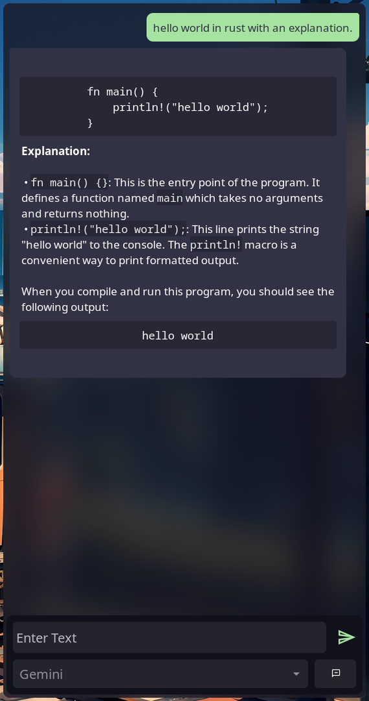
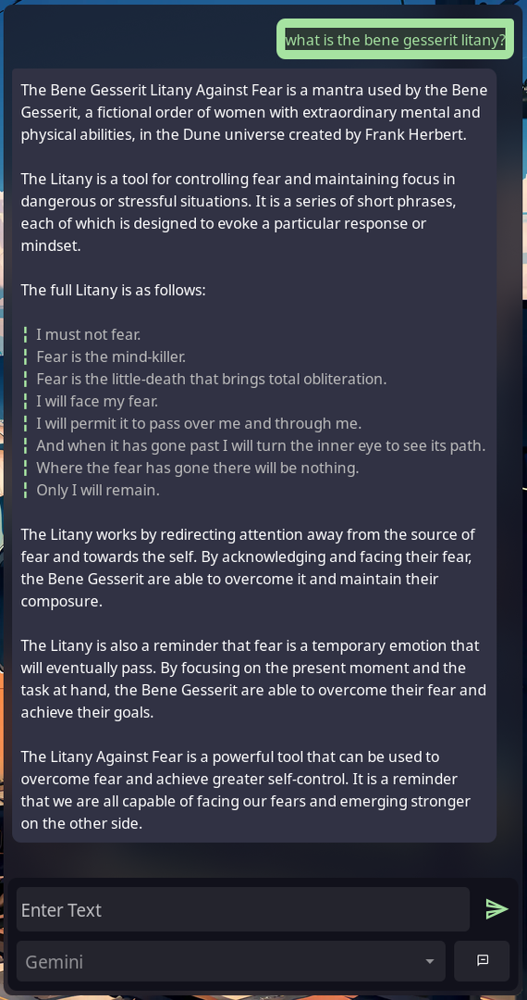
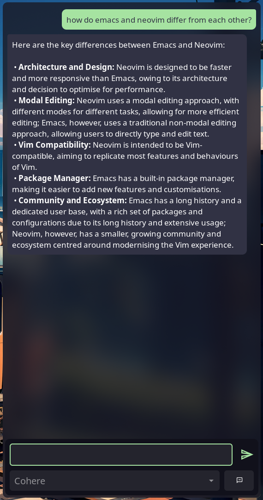

# Converse

converse is a frontend for LLMs like Gemini written with GTK in Rust.

|Gemini|Gemini|Cohere|
|--|--|--|
||||

## Supported Models
* ### [Gemini](https://gemini.google.com)
* ### [Claude](https://claude.ai)
* ### [Cohere](https://cohere.com)
* ### [OpenAI](https://chat.openai.com)

## Installation
* ### Pacman 
    ```bash
    sudo pacman -S gtk3 cargo git gtk-layer-shell
    ```
* ### Aur
    Using paru as an Aur helper,
    ```bash
    paru -S converse-git
    ```
* ### Apt
    ```bash
    sudo apt install cargo git libgtk-3-dev libgtk-layer-shell-dev
    ```

### Cloning and Building
```bash
git clone https://github.com/vishruth-thimmaiah/converse
cd converse
cargo build --release
# to run the binary
./target/release/converse
```
* Optional: copy the binary(`.target/release/converse`) to /usr/bin/ or ~/.local/bin to launch converse without the full path of the binary.

## Usage

* Copy example/config.toml to $HOME/.config/converse/config.toml
    ```bash
    cp example/config.toml ~/.config/converse/config.toml
    ```

* Set your api keys in the config file. LLMs that you do not wish to use can be disabled by setting `use_model` to 0.

## Theming
Create a file ~/.config/converse/style.css. CSS can be used to modify the appearance of the applicaion.
#### CSS Classes
* **main-window**: The main parent window.
* **tab-page**: The notebook widget containing the scrollable region.
* **label-model**: The label that shows non code responses from the LLM.
* **label-model-code**: The label that shows code responses from the LLM.
* **label-user**: The label that shows user prompts from the LLM.
* **control-area**: The part of the application containing the Entry, Send Button, etc.
* **entry**: The Entry where the user enters their query.
* **send-button**: Button used to send a prompt.
